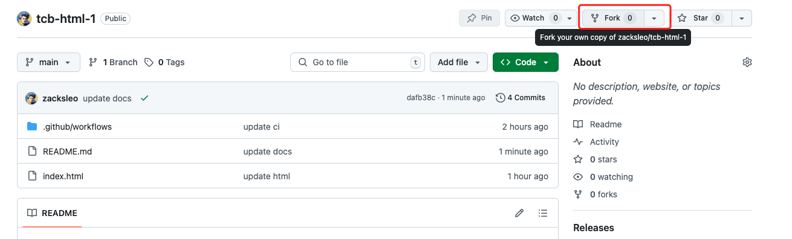
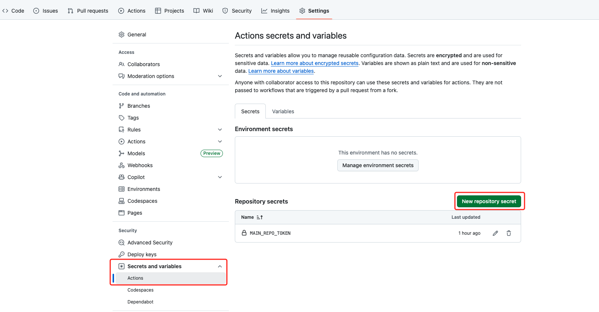
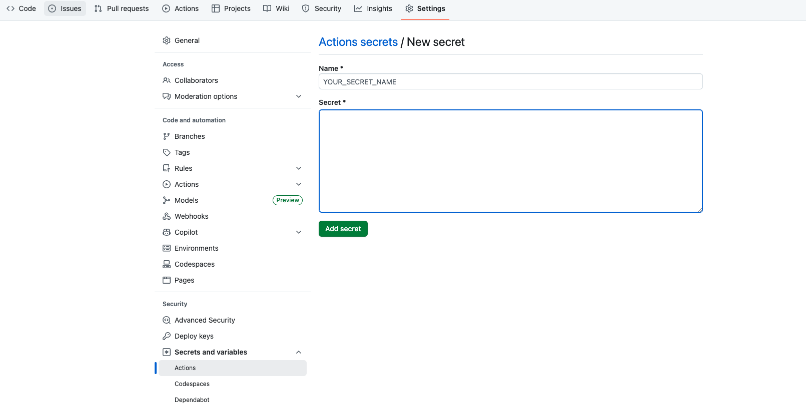
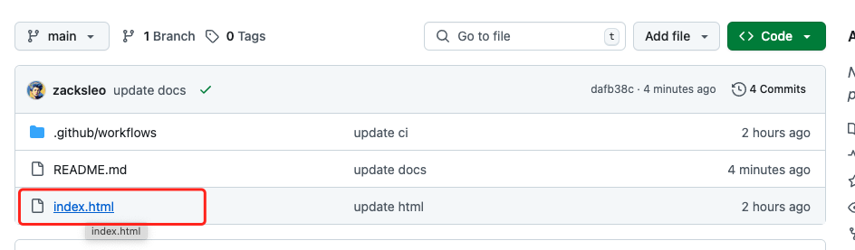
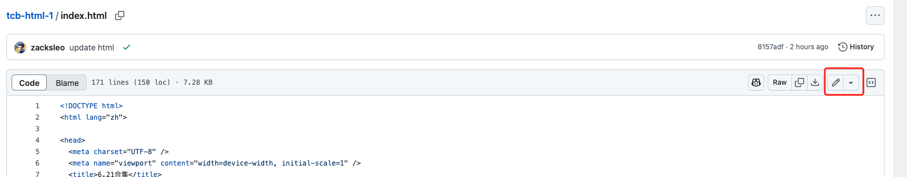
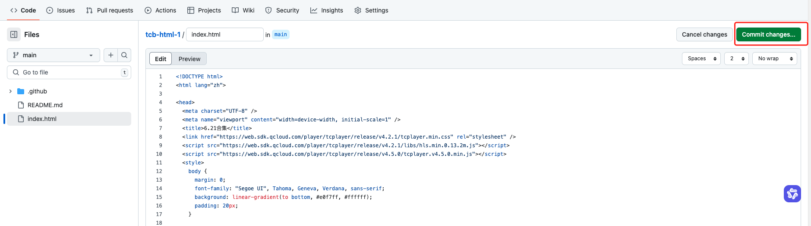
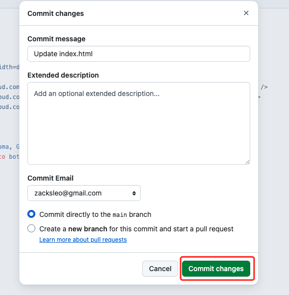
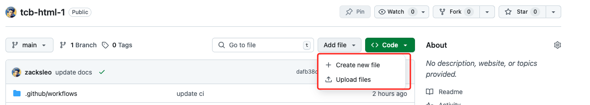

## 使用方法

## 克隆项目

点击 Fork 按钮，将项目克隆到自己的仓库中。

克隆成功后，打开自己克隆后的项目主页。

## 配置

1. 点击 Settings 按钮，进入项目设置页面。找到 Secrets and Variables 选项展开，点击 Actions，在 `Repository secrets` 处点击

`New repository secret` 按钮，添加以下变量。

2. 添加变量，变量名称为： MAIN_REPO_TOKEN，变量的值找管理员索取。

## 更新内容

1.回到仓库首页，找到需要编辑的 html 文件，点击打开。

2.在右上角找到编辑按钮，点击编辑。

3.点击完成后，点击 Commit changes 按钮，弹出对话框。

4.点击 Commit changes 按钮，提交修改。

## 添加文件

回到仓库首页，点击 Add file 按钮，点击 Create new file/ Upload 按钮，创建新的 html 文件。

